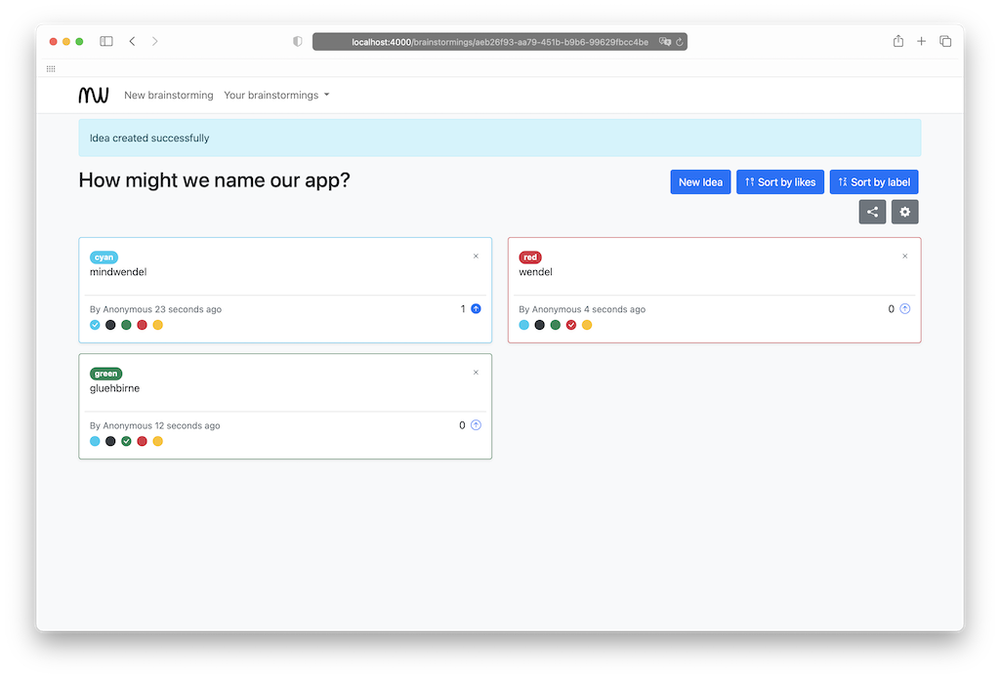

# mindwendel


Create a challenge. Ready? Brainstorm. mindwendel helps you to easily brainstorm and upvote ideas and thoughts within your team. Built from scratch with [Phoenix](https://www.phoenixframework.org).

## Features

- 5 minute setup (It is not a joke)
- Anonymously invite people to your brainstormings - no registration needed. Usernames are optional.
- Easily create and upvote ideas, with live updates from your companions.
- Preview of links to ease URL sharing
- Cluster your ideas with labels
- Export your generated ideas to html or csv (currently comma separated)
- German & English Translation files
- By default, brainstormings are deleted after 30 days to ensure GDPR compliancy.




## Use-cases

Brainstorm ...

- ... new business ideas
- ... solutions for a problem
- ... what to eat tonight
- ...

## Getting Started

mindwendel can be run just about anywhere. So checkout our [Installation Guides](./docs/installing_mindwendel.md) for detailed instructions for various deployments.

Here's the TLDR:

- Run mindwendel via Docker and reference your postgres database

  ```sh
  docker run -d --name mindwendel \
    -p 127.0.0.1:80:4000 \
    -e DATABASE_HOST="..." \
    -e DATABASE_PORT="5432" \
    -e DATABASE_NAME="mindwendel_prod" \
    -e DATABASE_USER="mindwendel_db_user" \
    -e DATABASE_USER_PASSWORD="mindwendel_db_user_password" \
    -e SECRET_KEY_BASE="generate_your_own_secret_key_base_and_save_it" \
    -e URL_HOST="your_domain_to_mindwendel" \
    ghcr.io/mindwendel/mindwendel
  ```

NOTE: mindwendel requires a postgres database. You can use [our docker-compose file](./docs/installing_mindwendel.md#running-on-docker-compose) to also install the postgres.

## Usage example

## Contributing

To get started with a development installation of mindwendel, follow the instructions below.

mindwendel is built on top of:

- [Elixir](https://elixir-lang.org/install.html)
- [Phoenix Framework](https://hexdocs.pm/phoenix/installation.html#phoenix)
- [Phoenix LiveView](https://github.com/phoenixframework/phoenix_live_view)
- [PostgreSQL](https://www.postgresql.org)

### Dev setup based on Docker

- Startup docker container
  ```sh
  docker-compose up
  ```
- Go to http://localhost:4000/

- Open you favorite editor and start developing

- Open a shell in the docker container to execute tests, etc.

  ```sh
  docker exec -it mindwendel sh
  ```

- In the shell, you can now execute all commands as on you local machine, see [testing commands](#testing)

### Dev setup an your local machine (without docker)

- Clone the repo
  ```sh
  git clone https://github.com/mindwendel/mindwendel.git
  ```
- Install dependencies with
  ```sh
  mix deps.get
  ```
- Copy and adjust local env variables, e.g. DATABASE_USER, DATABASE_NAME, etc.
  ```sh
  cp .env.default .env
  ```
- Load your env variables; NOTE: Always do this when your env settings change or your open a new terminal session
  ```sh
  source .env
  ```
- Create and migrate your database with
  ```sh
  mix ecto.setup
  ```
- Add seeds with
  ```sh
  mix run priv/repo/seeds.exs
  ```
- Install NPM packages
  ```sh
  npm --prefix assets install
  ```
- Start the phoenix server
  ```sh
  mix phx.server
  ```
- Go to http://localhost:4000/

### Testing

- Load the env variables for testing
  ```sh
  source .env
  ```
- Ensure your database is running and reset your database
  ```sh
  MIX_ENV=test mix ecto.reset
  ```
- Run the test
  ```sh
  mix test
  ```

### Build release and production docker image

- Build the docker image based on our Dockerfile
  ```sh
  docker build -t mindwendel_prod .
  ```

### Formatting

We are using Elixir's built-in formatter.

- Check if the code is properly formatted
  ```sh
  mix format --check-formatted
  ```
- Automatically format the code
  ```sh
  mix format
  ```

## Environment Variables

### Localisation
 
 Currently, there are two language files available, german ("de") and english ("en"). To set the default_locale, you can set `MW_DEFAULT_LOCALE`. The default is english.

 You can extract new strings to translate by running:
 ```
  mix gettext.extract --merge
 ```

## Contributing

1. Fork it (<https://github.com/mindwendel/mindwendel/fork>)
2. Create your feature branch (`git checkout -b fooBar`)
3. Commit your changes (`git commit -am 'Add some fooBar'`)
4. Push to the branch (`git push origin fooBar`)
5. Create a new Pull Request

## Testimonials


kits is a project platform hosted by a public institution for quality
development in schools (Lower Saxony, Germany) and focusses on digital tools
and media in language teaching. mindwendel is used in workshops to activate
prior knowledge, and collect and structure ideas. In addition, mindwendel can
be found on https://kits.blog/tools and can be used by schools for free. More info on
how to use it can be found in this post https://kits.blog/digitale-lesestrategien-brainstorming/

Logos and text provided with courtesy of kits.


## Acknowledgements

- https://github.com/JannikStreek
- https://github.com/gerardo-navarro
- https://github.com/nwittstruck
- Lightbulb stock image by LED Supermarket at Pexels: https://www.pexels.com/de-de/foto/die-gluhbirne-577514/
